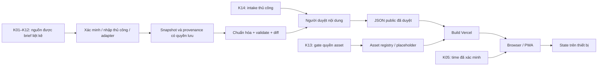

# Kiến trúc đề xuất

## Quyết định Phase 0 đã chốt

Các quyết định nhóm A được duyệt ngày **2026-09-29** và là baseline triển khai, không còn là đề xuất mở:

- **Frontend:** React + TypeScript + Vite, client-side SPA, không SSR; routing dùng React Router; package manager dùng pnpm; runtime dùng Node LTS. Phiên bản cụ thể phải được kiểm tra và pin khi thực hiện P0-I01.
- **Deploy:** repo `nhlan285/Sky_guide`, Vercel preview trước, domain `*.vercel.app`; Q15 **evolved 2026-10-04** cho phép free-tier relational DB/object storage và scheduler khi task/quota approved; không tự tạo tài nguyên trả phí.
- **Wardrobe renderer:** SVG paper-doll 2D với silhouette/layer tự tạo, hệ tọa độ chuẩn hóa [0,1] gốc trên-trái; dữ liệu size/rule demo phải gắn `fixture=true` và tách khỏi dữ liệu game thật.
- **Local state/share:** `localStorage` qua wrapper versioned có parse/validate và fallback in-memory; IndexedDB chỉ khi thật sự cần. Outfit share dùng URL fragment với payload versioned, nén + base64url, có `schemaVersion` và `catalogVersion`; không chứa QR/profile/dữ liệu cá nhân.
- **Notification:** mức đầu chỉ in-app reminder + notification khi app đang mở và người dùng chủ động bật. Web Push nền chỉ ở trạng thái research cho tới khi phạm vi lưu subscription server-side được thay đổi rõ ràng.
- **Ngôn ngữ/khả năng truy cập:** UI mặc định tiếng Việt; tên item/spirit/season giữ tên gốc tiếng Anh từ nguồn; ID không phụ thuộc tên hiển thị. Mục tiêu browser là Chrome/Edge desktop bản mới, Chrome Android và Safari iOS bản gần đây; accessibility hướng tới WCAG 2.2 AA.

Tài liệu giữ thiết kế/history scaffold; hiện SPA, Living Sky/Hub, K15 Item Lookup và Wardrobe demo đã có trên main. Trạng thái mới nhất ở [CURRENT_STATE](CURRENT_STATE.md). Nguồn sản phẩm: [brief](PROJECT_BRIEF.md) + quyết định maintainer 2026-10-04 trong roadmap Q20–Q23; contract source phải qua [KB](../knowledge/README.md). Design approval không xác minh source/provider hoặc chứng minh implementation.

## Stack và ranh giới hệ thống

- Frontend đã chốt (P0-I01): **React + TypeScript + Vite**, client-side SPA với React Router; không SSR. Đây là triển khai của Architecture v1 approved, không thay baseline.
- Toolchain khóa trong `package.json` và `pnpm-lock.yaml`: React/React DOM **19.3.0**, TypeScript **5.9.3**, Vite **8.3.2**, React Router DOM **7.18.4**, pnpm **10.30.3**. Node **24.x LTS**, bản local kiểm tra **24.11.0** (`.nvmrc`); Vercel dùng patch được platform hỗ trợ trên cùng major 24.x. Nâng version cần cập nhật lockfile và chạy lại gates; không tự chuyển major.
- Lý do: giữ stack đã duyệt, Vite build static SPA, React Router xử lý route client, pnpm + lockfile tái lập dependency. TypeScript 5.9.3 là bản ổn định tương thích lint tooling; không cần frontend framework thứ hai.
- Build contract: `pnpm install --frozen-lockfile`, `pnpm build` (typecheck rồi production Vite build), output `dist`. Lệnh độc lập và kiểm tra deployment được ghi ở README.
- Renderer đầu: 2D paper-doll, lớp ảnh/hình SVG tự tạo xếp theo cấu hình, không engine 3D giai đoạn đầu.
- Public catalog hiện tại: K15 JSON versioned validate/build cùng app. **Q20 supersedes canonical Q01:** long-term canonical metadata/relationships ở central PostgreSQL-compatible relational DB; JSON vẫn projection/export/cacheable snapshot/rollback/fixture. DB architecture approved, chưa provisioned.
- User state: reducer/context theo feature; localStorage cho thiết lập/outfit gọn. IndexedDB chỉ dùng khi route/cache hoặc lượng bản ghi vượt phạm vi gọn; chốt ngưỡng sau đo thực tế, không đặt hai kho làm nguồn sự thật cùng lúc.
- Deploy: Vercel SPA/PWA/static delivery, functions/API facade khi cần và CDN/cache-facing layer; existing R2 runtime routing đã sửa. Deployment storage/repository JSON không là database. K05 time proxy vẫn optional sau verify, không là dependency duy nhất cho Event Service.
- PWA: manifest + service worker, shell/cache public có version; thông báo xem phần riêng. Native ngoài các phase đầu.

## Luồng dữ liệu

Diagram sau là **historical JSON projection path** của Q01; canonical/API evolution theo Q20 ở mục dưới. Các private/export/rights boundaries vẫn áp dụng.

### Kho dữ liệu đã chốt — P0-D01 / Q01 (2026-10-01)

**Historical decision, SUPERSEDED / EVOLVED 2026-10-04 bởi Q20 về canonical ownership:** ngày 2026-10-01 Release 1 chọn JSON normalized versioned trong Git, không database server. Bảng sau giữ contract public projection và private boundaries; không mô tả JSON là canonical dài hạn hoặc xác nhận nguồn thật.

| Vùng | Vị trí quy định | Ai sử dụng / ranh giới |
|---|---|---|
| Public release | `data/public/<catalogVersion>/` trong repo này | Chỉ manifest, datasets, provenance public và alias/tombstone đã duyệt; có thể công khai cả lịch sử Git |
| Raw | `<private-workspace>/raw/` ngoài checkout public | Snapshot nguồn được phép lưu; giữ nguyên input/revision, không là input trực tiếp của client/build |
| Draft / reviewed | `<private-workspace>/draft/`, `<private-workspace>/reviewed/` | Normalized candidate, EditorialRecord và approval theo revision; reviewed chưa phải published |
| Quarantine / evidence | `<private-workspace>/quarantine/`, `<private-workspace>/evidence/` | Input lỗi, diff/review report và bằng chứng riêng tư; không vào Git public, Vercel hoặc cache client |
| Fixture kỹ thuật | `tests/fixtures/` khi task kiểm thử cần | Tự tạo và gắn `fixture=true`; không phải nguồn game, không nhập vào catalog phát hành |

`<private-workspace>` là thư mục vận hành ngoài repo hoặc checkout của repo riêng tư, do maintainer quản lý; chưa tạo workspace/repo riêng tư trong task này. Q16/P0-D03 đã chốt **contract nơi logic** `Sky Guide private workspace → Legal → TGC`, owner Maintainer / repository owner và [private evidence ledger](TGC_FOLLOW_UP.md); không là path/dịch vụ storage đã provisioning hoặc xác nhận permission TGC. Không đặt workspace này bên trong `public/`, `src/` hoặc checkout triển khai. Ignore các đường `data/raw/`, `data/draft/`, `data/reviewed/`, `data/quarantine/`, `data/private/`, `private/` chỉ là phòng ngừa local, **không biến chúng thành kho được phép commit** và không bảo vệ file đã tracked.

Luồng export snapshot: raw → normalized draft → validate/diff → review đúng revision → **public projection theo allowlist field** → `data/public/<catalogVersion>/` → review Git/build Preview → phát hành. Q20 bổ sung reviewed canonical DB + public API, không bỏ export/private gates. Không copy nguyên candidate/raw rồi xóa vài field. Nội dung sửa sau approval phải review lại; lỗi parse/validate/export giữ nguyên release tốt trước đó, không xuất catalog rỗng thay thế. Owner/reviewer/tool/source Discord vẫn cần chốt riêng ở Q02; Q01 không cấp quyền publish leak.

Client chỉ đọc release public được code chọn rõ; `src/data/` dành cho types/validators/read adapters, không là kho raw/draft. Build không đọc private workspace, không dùng glob toàn `data/**`, không fetch raw/draft ở runtime. `public/` của Vite được copy nguyên vào output nên chỉ chứa tài nguyên đã được phép công khai; không dùng làm vùng staging. `.vercelignore` loại vùng vận hành/fixture khỏi upload CLI; Git deployment chỉ nhận file tracked, vì vậy review Git và export gate vẫn bắt buộc.

Contract manifest/dataset, version và whitelist provenance nằm tại [DATA_SCHEMA](DATA_SCHEMA.md#public-catalog-contract--q01). Catalog build cùng code; rollback chọn deployment hoặc commit có cùng catalog/asset manifest tương thích. Raw/evidence không cần và không được mang theo deployment rollback. Không tạo manifest/catalog giả để biểu thị nguồn đã sẵn sàng: module chưa có dataset được coi là unavailable.

P0-D01 giữ DONE về **contract và ranh giới**. P2-D01/P2-D02/P2-D04 validators DONE theo roadmap; K15 importer/manifest/loader/build validation chỉ complete scoped Item Lookup. P2-D10–P2-D12/P2-I01/P2-H01 generic DoD vẫn OPEN. Không xây user auth/admin account trong V1.

### Central data / storage evolution — Q20–Q23 (2026-10-04)

**APPROVED/DESIGNED, implementation OPEN.** Canonical domain metadata/relationships
được maintainer review/promote vào relational DB PostgreSQL-compatible, schema
provider-neutral: Item, Spirit, Season, Event, EventRule, EventOverride, Location,
Cosmetic/Music/Emote/Honk-Call metadata và Media/provenance. Source-scoped crosswalk
giữ stable IDs K15, FK, revisions, soft deletion/alias/tombstone. Upstream là evidence;
raw/draft/quarantine/private rights evidence không trở thành public API fields.

Binary images/posters/video/honk-call audio-video/emote video/music samples ở
**Cloudflare R2 / S3-compatible object storage** (preferred direction); DB chỉ
ID/storage key/URL khi cần/role/source/provenance/rights/revision/timestamps/FKs.
Existing R2 image runtime không đồng nghĩa central DB/preview/sample pipeline xong.
Frontend đọc data abstraction qua `/api/items`, `/api/items/:id`, `/api/events/*`,
`/api/spirits/*`, không direct provider DB; JSON snapshot fallback/export vẫn hợp lệ.
Item/spirit TTL dài, live schedule TTL ngắn theo contract/quota, cache invalidation
khi revision/rights đổi; không poll countdown backend mỗi giây.

Sync dùng snapshot/hash/diff/normalization/quarantine/retry/source health/LKG,
promotion có review. Migration phải audit DB size/query latency/connections/
CPU/RAM/egress/cache hit/API latency và quota request/operation/egress/CPU/RAM/IOPS;
backup/export, restore test, rollback trước migrate sang larger managed PostgreSQL
hoặc PostgreSQL trên Sky Guide cloud server; frontend API contract giữ nguyên.
Provider lựa chọn sau review, không mặc định Supabase/Neon/Cloudflare DB. Không
provision trong task docs; scheduler/worker/cron chỉ khi task/quota approved, không
tự tạo paid resources. User state V1 tiếp tục local.

Item media Q21: `itemImage` 0..1 + `referenceImages[]` 0..N, dedupe primary khỏi
references; explicit source roles, không geometry/DOM-order inference. Event Q23
đa nguồn qua registry/verification, IANA `America/Los_Angeles`/DST, versioned
rules/occurrences, effective temporary overrides giữ base và LKG health. Q22 shared
poster/lazy animated preview và Music itemId→sampleSetId không binary trong DB.
Chi tiết contract, budgets, validation và thứ tự **R0→R1→R2→R3→R4→R5→R6** ở
[roadmap Phase 9](plan/IMPLEMENTATION_PLAN.md#phase-9--data-event-và-media-refresh-approveddesigned-2026-10-04).

## Tổ chức thư mục mã (chỉ khung)

| Đường dẫn | Trách nhiệm khi bắt đầu code |
|---|---|
| `src/app` | Bootstrap, routes, top-level providers, khôi phục state |
| `src/features/wardrobe` | Editor, reducer, resolver rule, layer renderer, outfit codec |
| `src/features/hub` | Catalog, TS, season/event, news, maps/routes, IAP |
| `src/features/profile` | QR decode/validate/display sau xác minh protocol |
| `src/shared` | Primitive UI, accessibility, error/empty/stale state, storage wrapper |
| `src/data` | Normalized types, validation, data read adapters; không chứa draft |
| `src/pwa` | Manifest integration, service worker lifecycle, notification capability |

K15 scoped importer/JSON public/loader đã có; generic adapters cho module khác và central DB/API còn OPEN theo roadmap, không suy complete từ shell/build.

## Contract Wardrobe 2D đã chốt — P0-W01 / P0-W02 / Q08 (2026-10-02)

Phase 0 và Phase 4 dùng **SVG paper-doll 2D**, silhouette/layer hình học hoàn toàn self-created. Bộ [fixture SVG](../tests/fixtures/wardrobe/README.md) là bằng chứng trực quan P0-W01, mở độc lập để xem; không được import vào app, public catalog hoặc manifest Preview/Production. Đây là **configurable project contract / fixture behavior**, không phải verified Sky game behavior. Phase 0 chốt contract và fixture tĩnh; renderer, picker, resolver, bảng calibration versioned và manifest demo đầy đủ vẫn thuộc các task sau.

Wardrobe V1 (2026-10-03) có route `/wardrobe` tải riêng [package demo mới](../src/features/wardrobe/demo/README.md), được yêu cầu triển khai như nội dung demo hiển thị trên app. Package giữ fixture/self-created và nằm ngoài public real-data catalog; không nới ranh giới test fixture/private/pending full asset. Reducer local trong editor giữ selection qua theme/locale changes, không persist outfit; manifest/geometry tạo một lần, layers derive bằng memo và không cập nhật ambient Canvas khi chọn đồ. Mobile dùng preview trước rồi panel lựa chọn/outfit, không overlay lên nhân vật. Q08 giữ nguyên.

### Slot, lớp và resolver

- `WardrobeConfig` versioned ghim canonical model/revision và `SlotPolicy` cho từng slot. `maxItems` là số nguyên ≥ 1: 1 cho single-item, > 1 cho multiple items; không có default ngầm khi thiếu policy. Fixture policy chọn 1 cho sáu slot; một ví dụ cấu hình accessory=2 chỉ chứng minh capability. Không suy ra số phụ kiện game cho phép.
- `equippedBySlot: Record<slot, ID[]>` giữ mảng kể cả slot đơn, không lặp ID; mảng rỗng là đã tháo hết. Equip vượt capacity bị reject với lý do, selection trước đó giữ nguyên; thay item slot đơn là thao tác replace tường minh. Import/restore cũng validate theo config đang ghim, không tự cắt mảng. Thứ tự mảng không quyết định z-order.
- Một item có 0..N `LayerBinding`; mỗi binding trỏ asset qua `AssetRegistry`, có revision, anchor key và `zIndex` riêng. Ví dụ item giả `fixture-item-wrap` có `fixture-binding-rear`/`fixture-binding-front`; đây là capability nhiều lớp, không mô tả asset game hiện có. Render tăng dần `zIndex` (số lớn vẽ sau), bằng nhau sort `binding.id` theo thứ tự chuỗi code-unit ổn định, không theo locale/item ID trong component. Silhouette cũng có z-order trong cấu hình, không là lớp đặc biệt hardcode.
- Compatibility chỉ dùng evidence hoặc rule `fixture=true`. Thu thập mọi rule có trigger đang active (tất cả `triggerItemIds` phải được equip), sort `priority` giảm dần rồi `rule.id` tăng dần theo code-unit. Với `set_effective_size`, priority lớn nhất thắng; rule thấp hơn không ghi đè winner. `reject_combination` báo selection không tương thích, không tự tháo item hoặc mutate selection.
- Validator phải báo **error** khi hai rule có thể cùng active, cùng priority và ghi giá trị khác nhau lên cùng target; không chỉ kiểm tra outfit hiện tại. Runtime nếu gặp content này trả `rule_conflict` và cảnh báo với rule IDs; stable ID có thể chọn preview tạm deterministic nhưng không biến content thành hợp lệ hoặc cho persist/share kết quả như đã resolve. Không random winner.
- Mỗi lần equip/unequip/đổi base size đều derive lại từ selection: `effectiveSizeCode = baseSizeCode` trước khi áp winner. Override không mutate base size, không persist effective state. Tháo item override cuối cùng trả về base size; nếu còn rule active khác thì derive lại theo priority. Mã size thật/chibi mapping vẫn unknown; ví dụ resolver chỉ dùng code có tiền tố `fixture-`.

### Anchor và transform

Canonical model có `modelId` và `modelRevision`; hệ tọa độ normalized `[0,1]`, origin top-left, x tăng sang phải/y tăng xuống dưới. Asset SVG khai báo viewBox hợp lệ; pivot normalized theo asset được đổi về đơn vị canonical trước transform. Tra anchor bằng khóa đầy đủ `(modelId, modelRevision, effectiveSizeCode, slot, anchorName, assetId, assetRevision, bindingId, bindingRevision)`, không dùng anchor size/revision khác làm fallback ngầm. Binding/asset đổi revision làm calibration cũ không còn khớp; `calibrationRevision` nhận diện bộ calibration đã review.

Anchor lưu trong **canonical chưa scale**; `scaleItem` là scale cục bộ của binding, không chứa scale nhân vật. `p_model = anchorModel + scaleItem * rotate(p_asset - pivotAsset)`; sau đó một group nhân vật áp `ScaleTable` đúng một lần, rồi viewBox/viewport map tới pixel đúng một lần. Không nhân scale nhân vật vào cả anchor lẫn layer, không bake scale viewport vào bảng. `ScaleTable` lookup `(modelId, modelRevision, effectiveSizeCode)`.

Thiếu policy/size/asset/anchor hoặc lệch revision trả trạng thái rõ `missing_slot_policy`, `missing_size`, `missing_asset`, `missing_anchor`, `revision_mismatch`; layer liên quan dùng placeholder có nhãn hoặc bị bỏ cùng cảnh báo. Không đoán tọa độ/scale “đúng”; phần selection hợp lệ vẫn giữ để người dùng sửa. Giá trị số trong fixture chỉ minh họa hình học tự tạo, không là calibration thật.

## State Wardrobe và phép biến đổi

State đầu vào `WardrobeSelection`: `schemaVersion`, `baseSizeCode`, `equippedBySlot`, `dyeByItemRegion`. State dẫn xuất: `effectiveSizeCode`, `appliedRuleIds`, `renderLayers`, cảnh báo asset/anchor thiếu. Không persist state dẫn xuất để tránh lỗi khi đổi bảng/rule.

Demo compatibility decision (2026-10-06): adding the fictional tile-mask scale rule changes package `demo-wardrobe-v1-r1` to `r2`. Geometry and item/size IDs remain unchanged. The editor permits only that exact demo-ID-scoped snapshot transition, revalidates all fields and recomputes effective state. Its local library keeps the original r1 key; read projects in memory and an explicit save writes r2. Other versions/IDs remain rejected. This bounded continuity contract does not implement generic item aliases/tombstones (P4-W11).

Trình tự xử lý theo contract Q08:

1. Validate ID item/slot, khả năng phối và định dạng màu.
2. Thu thập applicable rules; sắp `priority` giảm dần rồi ID ổn định, xử lý conflict theo contract trên.
3. Derive effective size từ `baseSizeCode` mà không đổi base; “chibi override” chỉ là behavioral fixture, mã size thực tế chưa được cung cấp.
4. Tra `ScaleTable` theo effective size + model revision. Thiếu entry thì hiện lỗi/placeholder rõ, không dùng ngầm một tỷ lệ “đúng”.
5. Tra `AnchorTable` theo khóa model/revision + effective size + slot/anchor + asset/binding revision ở trên; build layer order từ cấu hình.
6. Áp dye chỉ lên region/mask được khai báo; ghép các lớp và render.

Contract tọa độ/transform và thứ tự lớp được chốt ở mục Q08 trên. Cape tách trước/sau và phụ kiện có anchor riêng là capability cấu hình, **chưa phải thông tin game**.

`AssetRegistry` tách item khỏi file: cùng item có preview placeholder hoặc asset được xác nhận sau này; mỗi entry có revision, renderer kind, source, legal status và capability. 3D về sau có thể cung cấp renderer khác, nhưng không đưa pipeline 3D vào phần sẵn sàng triển khai. Toàn bộ full asset: **pending legal confirmation** ([K13](../knowledge/13-tgc-assets.md)).

## Local storage và chia sẻ

- Bọc storage với parse/validate/version migration; ghi lỗi quota/cấm storage thành trạng thái rõ và tiếp tục trong memory.
- Outfit link đề xuất chứa payload nhỏ trong URL fragment, gồm ID/version/size/dye; không chứa QR profile, dữ liệu cá nhân hay ảnh binary. Giới hạn kích thước và codec phải chốt sau thử round-trip.
- Không có short-link service hoặc database share. Link chỉ hoạt động khi data version/item ID còn ánh xạ được; tombstone/alias là phần migration.
- Import state phải kiểm tra schema, độ dài, ID và màu; link không được cung cấp tùy ý URL asset để trình duyệt fetch.
- Local state được export/reset có chọn phạm vi; không hứa bảo toàn khi trình duyệt xóa dữ liệu. Camera frame/ảnh QR là dữ liệu tạm và mặc định không persist.

## Pipeline theo nguồn

| Đầu ra | Nguồn cứng | Đường đi đề xuất và điểm dừng |
|---|---|---|
| Item/price game | [K01](../knowledge/01-wiki-items.md) | API Wiki đã xác minh → parse module thật → normalized Item; dừng nếu format chưa rõ |
| Spirit/tree | [K02](../knowledge/02-wiki-regular-spirits.md) | Wiki hoặc nhập thủ công có revision → kiểm tra graph/cost |
| TS history | [K03](../knowledge/03-wiki-traveling-spirits.md), [K04](../knowledge/04-ts-calculator.md) | Hai adapter độc lập → diff → biên tập xử lý xung đột |
| Time | [K05](../knowledge/05-thatskyapi.md) | Tích hợp trực tiếp nếu khả thi; TimeReference riêng, không build-time timestamp cố định làm đồng hồ live |
| Patch/news | [K06](../knowledge/06-official-patch-notes.md) | Tóm tắt + link thủ công → review; automation chỉ sau kiểm tra |
| Season/event | Q23 source registry đa nguồn đã verify theo field | Official → verified official override → structured community → cross-checked → calculated/prediction có nhãn; P9-D07 verify candidates/KB trước adapters; không gán K05 là feed season |
| Map/markers | [K07](../knowledge/07-wiki-map-shrines.md) | Text + tọa độ biên tập + asset riêng có quyền; không suy ra coordinate từ tên |
| Route | [K08](../knowledge/08-appunwrapper.md), [K09](../knowledge/09-wiki-video-playlists.md) | Viết lại từng bước, dẫn nguồn; không copy full text/media |
| IAP | [K10](../knowledge/10-app-store-iap.md)–[K12](../knowledge/12-apppricinglab.md) | Observation có platform/market/time → SKU mapping đã xác minh → phép tính có giả định |
| Asset | [K13](../knowledge/13-tgc-assets.md) | Registry placeholder trước; full asset chỉ sau legal gate |
| Leak | [K14](../knowledge/14-discord-editorial.md) | Intake manual → đối chiếu K06 → người duyệt → public projection |

Mỗi lần import: kiểm tra nguồn → lưu provenance/snapshot cho phép → normalize → validate quan hệ → quarantine bản ghi hỏng → diff với bản cũ → review → canonical promotion/public projection theo Q20 → publish khi đạt gate. JSON build snapshot là một delivery path, không bắt buộc rebuild frontend cho mỗi live event update. Parser lỗi không làm danh sách rỗng ghi đè bản tốt. Upstream đổi field báo lỗi và giữ LKG có nhãn stale. Retry/backoff/cadence/TTL theo source contract/quota đã verify.

## Countdown và thời gian

Q23 Event Engine resolve verified EventRule/Override thành EventOccurrence theo
IANA **America/Los_Angeles**, không hardcoded UTC-7/UTC-8 hoặc giờ Việt Nam source
of truth. Recurring anchor/offset/interval/effectiveFrom/effectiveUntil ở domain,
không UI; override effective range/priority không mutate base rule. Live API trả
server/generated time/version/active/upcoming/startsAt/endsAt/source confidence;
TimeReference K05 optional sau verify. UI countdown local/localize user timezone,
sleep/wake revalidate có giới hạn, không per-second API poll. Upstream failure giữ
LKG + healthy/delayed/stale/offline; no verified dates/LKG thì unavailable.
Prediction/calculated không như official; DST/override/source-failure tests ở P9-V03.

## PWA và notification

Research-only [P6-R01/R02 assessment](plan/WEB_PUSH_NATIVE_RESEARCH.md) distinguishes private Web Push subscription/sender infrastructure from local foreground V1 and defines criteria for a future native proposal. No push service or native project is implemented or authorized by that assessment.

Phân biệt hai mức đề xuất để không xung đột yêu cầu toàn bộ trạng thái local:

1. **Mức đầu:** in-app reminder và notification do người dùng bật khi app đang hoạt động, dùng mốc nguồn đã kiểm chứng. Capability detection, xin quyền qua thao tác trực tiếp, xử lý denied/unsupported. Không hứa hẹn báo đúng lúc khi app đóng hoặc tab bị ngủ.
2. **Web Push nền:** nghiên cứu sau khi người dùng chốt phạm vi. Cần subscription endpoint/key và hạ tầng gửi; dù không cần tài khoản, lưu subscription server-side vẫn mâu thuẫn với cách hiểu nghiêm ngặt “toàn bộ trạng thái local”. Vì vậy **không thuộc phương án mặc định**; chỉ triển khai nếu yêu cầu này được điều chỉnh rõ. Không giả định service worker tự chạy lịch nền chính xác.

Service worker đề xuất cache shell và public catalog versioned; không cache QR, draft, ticket hay dữ liệu nhạy cảm. Cache dữ liệu công khai cần ngày sync và nhãn offline. Cập nhật shell/data atomically theo manifest version; thông báo bản mới và cho người dùng chọn reload để không mất outfit đang sửa. Size/quota có fallback; offline không giả lập dữ liệu mới.

## Vercel và vận hành

Phase đầu dùng deploy preview từ repo đã chọn, rồi production sau checklist. P0-I01–I04 khóa toolchain trong `package.json`/lockfile; `vercel.json` dùng `pnpm install --frozen-lockfile`, `pnpm lint && pnpm build`, output `dist` được xác minh bằng production build. Rewrite `/(.*)` về `/index.html` để mở trực tiếp deep link; React Router có `/`, `/about` và trang not-found. Quy trình Preview/rollback và bằng chứng nghiệm thu ở README; không bật resource trả phí.

Build gate: type/lint theo tool đã chọn, schema/reference checks, cấm draft trong bundle, asset rights manifest, behavioral tests reducer/codec/IAP, rồi smoke UI. Chưa bật cron hoặc dịch vụ trả phí: lịch cập nhật ban đầu do maintainer chạy thủ công, tự động hóa chỉ sau khi biết giới hạn và chi phí. Nếu proxy cần secret, chỉ server environment; không để secret trong bundle. Rollback gồm cả code + data + asset manifest tương thích, không chỉ HTML.

## Các quyết định còn mở

Stack/renderer/local state/foreground notification giữ quyết định cũ. Q01 projection/private boundaries giữ, canonical ownership superseded bởi Q20; Q15 evolved, Q21–Q23 approved/design chưa implemented. Moderation leak, prediction TS, QR, price mapping, attribution/source/rights còn gate tương ứng trong [roadmap](plan/IMPLEMENTATION_PLAN.md). Không endpoint, game data, provider quota hoặc license nào được xác nhận chỉ bằng kiến trúc này.
