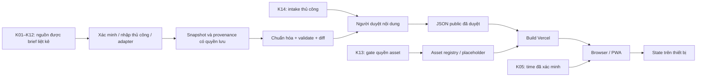

# Kiến trúc đề xuất

## Quyết định Phase 0 đã chốt

Các quyết định nhóm A được duyệt ngày **2026-09-29** và là baseline triển khai, không còn là đề xuất mở:

- **Frontend:** React + TypeScript + Vite, client-side SPA, không SSR; routing dùng React Router; package manager dùng pnpm; runtime dùng Node LTS. Phiên bản cụ thể phải được kiểm tra và pin khi thực hiện P0-I01.
- **Deploy:** repo `nhlan285/Sky_guide`, Vercel preview trước, domain `*.vercel.app` ở giai đoạn đầu; không tạo cron, DB, KV hoặc tài nguyên trả phí mặc định.
- **Wardrobe renderer:** SVG paper-doll 2D với silhouette/layer tự tạo, hệ tọa độ chuẩn hóa [0,1] gốc trên-trái; dữ liệu size/rule demo phải gắn `fixture=true` và tách khỏi dữ liệu game thật.
- **Local state/share:** `localStorage` qua wrapper versioned có parse/validate và fallback in-memory; IndexedDB chỉ khi thật sự cần. Outfit share dùng URL fragment với payload versioned, nén + base64url, có `schemaVersion` và `catalogVersion`; không chứa QR/profile/dữ liệu cá nhân.
- **Notification:** mức đầu chỉ in-app reminder + notification khi app đang mở và người dùng chủ động bật. Web Push nền chỉ ở trạng thái research cho tới khi phạm vi lưu subscription server-side được thay đổi rõ ràng.
- **Ngôn ngữ/khả năng truy cập:** UI mặc định tiếng Việt; tên item/spirit/season giữ tên gốc tiếng Anh từ nguồn; ID không phụ thuộc tên hiển thị. Mục tiêu browser là Chrome/Edge desktop bản mới, Chrome Android và Safari iOS bản gần đây; accessibility hướng tới WCAG 2.2 AA.

Tài liệu là **đề xuất thiết kế**, chưa cài dependency, chưa triển khai dịch vụ. Nguồn sản phẩm: [brief](PROJECT_BRIEF.md). Contract nguồn chỉ lấy từ [K01–K14](../knowledge/README.md); endpoint/SDK/platform capability phải xác minh khi triển khai, không được coi là đã kiểm tra ở scaffold này.

## Stack và ranh giới hệ thống

- Frontend đã chốt (P0-I01): **React + TypeScript + Vite**, client-side SPA với React Router; không SSR. Đây là triển khai của Architecture v1 approved, không thay baseline.
- Toolchain khóa trong `package.json` và `pnpm-lock.yaml`: React/React DOM **19.3.0**, TypeScript **5.9.3**, Vite **8.3.2**, React Router DOM **7.18.4**, pnpm **10.30.3**. Node **24.x LTS**, bản local kiểm tra **24.11.0** (`.nvmrc`); Vercel dùng patch được platform hỗ trợ trên cùng major 24.x. Nâng version cần cập nhật lockfile và chạy lại gates; không tự chuyển major.
- Lý do: giữ stack đã duyệt, Vite build static SPA, React Router xử lý route client, pnpm + lockfile tái lập dependency. TypeScript 5.9.3 là bản ổn định tương thích lint tooling; không cần frontend framework thứ hai.
- Build contract: `pnpm install --frozen-lockfile`, `pnpm build` (typecheck rồi production Vite build), output `dist`. Lệnh độc lập và kiểm tra deployment được ghi ở README.
- Renderer đầu: 2D paper-doll, lớp ảnh/hình SVG tự tạo xếp theo cấu hình, không engine 3D giai đoạn đầu.
- Public catalog: file JSON versioned được validate và build cùng app. Không cần database server ở release đầu; schema logic vẫn có ID/quan hệ để thay kho dữ liệu khi có nhu cầu đã xác nhận.
- User state: reducer/context theo feature; localStorage cho thiết lập/outfit gọn. IndexedDB chỉ dùng khi route/cache hoặc lượng bản ghi vượt phạm vi gọn; chốt ngưỡng sau đo thực tế, không đặt hai kho làm nguồn sự thật cùng lúc.
- Deploy: Vercel static build. Vercel Function proxy time **chỉ là phương án** nếu K05 không cho gọi trực tiếp qua CORS; không biến proxy thành crawler tổng quát hoặc nơi lưu người dùng.
- PWA: manifest + service worker, shell/cache public có version; thông báo xem phần riêng. Native ngoài các phase đầu.

## Luồng dữ liệu

### Kho dữ liệu đã chốt — P0-D01 / Q01 (2026-10-01)

Release 1 dùng **JSON normalized versioned trong Git**, không database server. Quyết định này cụ thể hóa public catalog/provenance/review gates của Architecture v1 approved; không thay baseline hoặc xác nhận nguồn thật.

| Vùng | Vị trí quy định | Ai sử dụng / ranh giới |
|---|---|---|
| Public release | `data/public/<catalogVersion>/` trong repo này | Chỉ manifest, datasets, provenance public và alias/tombstone đã duyệt; có thể công khai cả lịch sử Git |
| Raw | `<private-workspace>/raw/` ngoài checkout public | Snapshot nguồn được phép lưu; giữ nguyên input/revision, không là input trực tiếp của client/build |
| Draft / reviewed | `<private-workspace>/draft/`, `<private-workspace>/reviewed/` | Normalized candidate, EditorialRecord và approval theo revision; reviewed chưa phải published |
| Quarantine / evidence | `<private-workspace>/quarantine/`, `<private-workspace>/evidence/` | Input lỗi, diff/review report và bằng chứng riêng tư; không vào Git public, Vercel hoặc cache client |
| Fixture kỹ thuật | `tests/fixtures/` khi task kiểm thử cần | Tự tạo và gắn `fixture=true`; không phải nguồn game, không nhập vào catalog phát hành |

`<private-workspace>` là thư mục vận hành ngoài repo hoặc checkout của repo riêng tư, do maintainer quản lý; phiên này chưa tạo workspace/repo riêng tư hay chọn nơi lưu ticket TGC (Q16/P0-D03 còn mở). Không đặt workspace này bên trong `public/`, `src/` hoặc checkout triển khai. Ignore các đường `data/raw/`, `data/draft/`, `data/reviewed/`, `data/quarantine/`, `data/private/`, `private/` chỉ là phòng ngừa local, **không biến chúng thành kho được phép commit** và không bảo vệ file đã tracked.

Luồng duy nhất: raw → normalized draft → validate/diff → review đúng revision → **public projection theo allowlist field** → `data/public/<catalogVersion>/` → review Git/build Preview → phát hành. Không copy nguyên candidate/raw rồi xóa vài field. Nội dung sửa sau approval phải review lại; lỗi parse/validate/export giữ nguyên release tốt trước đó, không xuất catalog rỗng thay thế. Owner/reviewer/tool/source Discord vẫn cần chốt riêng ở Q02; Q01 không cấp quyền publish leak.

Client chỉ đọc release public được code chọn rõ; `src/data/` dành cho types/validators/read adapters, không là kho raw/draft. Build không đọc private workspace, không dùng glob toàn `data/**`, không fetch raw/draft ở runtime. `public/` của Vite được copy nguyên vào output nên chỉ chứa tài nguyên đã được phép công khai; không dùng làm vùng staging. `.vercelignore` loại vùng vận hành/fixture khỏi upload CLI; Git deployment chỉ nhận file tracked, vì vậy review Git và export gate vẫn bắt buộc.

Contract manifest/dataset, version và whitelist provenance nằm tại [DATA_SCHEMA](DATA_SCHEMA.md#public-catalog-contract--q01). Catalog build cùng code; rollback chọn deployment hoặc commit có cùng catalog/asset manifest tương thích. Raw/evidence không cần và không được mang theo deployment rollback. Không tạo manifest/catalog giả để biểu thị nguồn đã sẵn sàng: module chưa có dataset được coi là unavailable.

P0-D01 chốt **contract và ranh giới**. Types/validators (P2-D01–D04), importer (P2-D05–D10), export/rights gates (P2-D11), manifest/rollback implementation (P2-D12), build gate (P2-I01) và client data access (P2-H01) chưa triển khai. Người vận hành dùng Git hiện có; không xây auth/admin account cho sản phẩm.

## Tổ chức thư mục mã (chỉ khung)

| Đường dẫn | Trách nhiệm khi bắt đầu code |
|---|---|
| `src/app` | Bootstrap, routes, top-level providers, khôi phục state |
| `src/features/wardrobe` | Editor, reducer, resolver rule, layer renderer, outfit codec |
| `src/features/hub` | Catalog, TS, season/event, news, maps/routes, IAP |
| `src/features/profile` | QR decode/validate/display sau xác minh protocol |
| `src/shared` | Primitive UI, accessibility, error/empty/stale state, storage wrapper |
| `src/data` | Normalized types, validation, data read adapters; không chứa draft |
| `src/pwa` | Manifest integration, service worker lifecycle, notification capability |

Scripts import và JSON public sẽ được thêm ở task dữ liệu tương ứng; shell/build hiện có không tích hợp nguồn thật.

## State Wardrobe và phép biến đổi

State đầu vào `WardrobeSelection`: `schemaVersion`, `baseSizeCode`, `equippedBySlot`, `dyeByItemRegion`. State dẫn xuất: `effectiveSizeCode`, `appliedRuleIds`, `renderLayers`, cảnh báo asset/anchor thiếu. Không persist state dẫn xuất để tránh lỗi khi đổi bảng/rule.

Trình tự xử lý đề xuất:

1. Validate ID item/slot, khả năng phối và định dạng màu.
2. Thu thập rule từ item đang mặc; sắp theo `priority`, rồi ID ổn định. Xung đột ngang ưu tiên phải bị báo trong validate nội dung; tie-break runtime chỉ giúp kết quả ổn định.
3. Tính effective size mà không đổi `baseSizeCode`; rule mask chibi là ví dụ yêu cầu, mã size thực tế chưa được cung cấp.
4. Tra `ScaleTable` theo effective size + model revision. Thiếu entry thì hiện lỗi/placeholder rõ, không dùng ngầm một tỷ lệ “đúng”.
5. Tra `AnchorTable` theo model + size + slot/anchor + asset revision; build layer order từ cấu hình đã chốt.
6. Áp dye chỉ lên region/mask được khai báo; ghép các lớp và render.

Đề xuất hệ tọa độ canonical có gốc góc trên trái, trục x sang phải/y xuống dưới; tọa độ anchor chuẩn hóa [0,1]. Transform asset cục bộ: `p_model = anchorModel + scaleItem * rotate(p_asset - pivotAsset)`, sau đó áp scale nhân vật/viewport đúng một lần. `pivotAsset` chuyển sang cùng đơn vị canonical trước tính. Bảng calibration phải khai báo rõ scale theo size được áp ở tầng nào, tránh nhân scale hai lần. Thứ tự lớp **chưa phải thông tin game**: file cấu hình cho phép cape tách trước/sau và phụ kiện có anchor riêng nếu asset yêu cầu.

`AssetRegistry` tách item khỏi file: cùng item có preview placeholder hoặc asset được xác nhận sau này; mỗi entry có revision, renderer kind, source, legal status và capability. 3D về sau có thể cung cấp renderer khác, nhưng không đưa pipeline 3D vào phần sẵn sàng triển khai. Toàn bộ full asset: **pending legal confirmation** ([K13](../knowledge/13-tgc-assets.md)).

## Local storage và chia sẻ

- Bọc storage với parse/validate/version migration; ghi lỗi quota/cấm storage thành trạng thái rõ và tiếp tục trong memory.
- Outfit link đề xuất chứa payload nhỏ trong URL fragment, gồm ID/version/size/dye; không chứa QR profile, dữ liệu cá nhân hay ảnh binary. Giới hạn kích thước và codec phải chốt sau thử round-trip.
- Không có short-link service hoặc database share. Link chỉ hoạt động khi data version/item ID còn ánh xạ được; tombstone/alias là phần migration.
- Import state phải kiểm tra schema, độ dài, ID và màu; link không được cung cấp tùy ý URL asset để trình duyệt fetch.
- Local state được export/reset có chọn phạm vi; không hứa bảo toàn khi trình duyệt xóa dữ liệu. Camera frame/ảnh QR là dữ liệu tạm và mặc định không persist.

## Pipeline theo nguồn

| Đầu ra | Nguồn cứng | Đường đi đề xuất và điểm dừng |
|---|---|---|
| Item/price game | [K01](../knowledge/01-wiki-items.md) | API Wiki đã xác minh → parse module thật → normalized Item; dừng nếu format chưa rõ |
| Spirit/tree | [K02](../knowledge/02-wiki-regular-spirits.md) | Wiki hoặc nhập thủ công có revision → kiểm tra graph/cost |
| TS history | [K03](../knowledge/03-wiki-traveling-spirits.md), [K04](../knowledge/04-ts-calculator.md) | Hai adapter độc lập → diff → biên tập xử lý xung đột |
| Time | [K05](../knowledge/05-thatskyapi.md) | Tích hợp trực tiếp nếu khả thi; TimeReference riêng, không build-time timestamp cố định làm đồng hồ live |
| Patch/news | [K06](../knowledge/06-official-patch-notes.md) | Tóm tắt + link thủ công → review; automation chỉ sau kiểm tra |
| Season/event | K01/K06 nếu có chứng cứ phù hợp | Không gán K05 là feed season; chưa có chứng cứ thì unavailable |
| Map/markers | [K07](../knowledge/07-wiki-map-shrines.md) | Text + tọa độ biên tập + asset riêng có quyền; không suy ra coordinate từ tên |
| Route | [K08](../knowledge/08-appunwrapper.md), [K09](../knowledge/09-wiki-video-playlists.md) | Viết lại từng bước, dẫn nguồn; không copy full text/media |
| IAP | [K10](../knowledge/10-app-store-iap.md)–[K12](../knowledge/12-apppricinglab.md) | Observation có platform/market/time → SKU mapping đã xác minh → phép tính có giả định |
| Asset | [K13](../knowledge/13-tgc-assets.md) | Registry placeholder trước; full asset chỉ sau legal gate |
| Leak | [K14](../knowledge/14-discord-editorial.md) | Intake manual → đối chiếu K06 → người duyệt → public projection |

Mỗi lần import: kiểm tra nguồn → lưu provenance/snapshot cho phép → normalize → validate quan hệ → quarantine bản ghi hỏng → diff với bản cũ → review → xuất public JSON → build preview → publish khi đạt gate. Parser lỗi không được làm danh sách rỗng ghi đè bản tốt. Upstream đổi field phải báo lỗi và giữ last-known-good có nhãn stale. Retry/backoff, cadence và TTL đặt theo đặc tính nguồn sau xác minh, không suy đoán hạn mức API.

## Countdown và thời gian

TimeReference cần thời gian nguồn, thời điểm nhận và đơn vị đã kiểm chứng. UI ước lượng thời gian trôi qua từ mốc này để render mỗi giây; đây là nội suy hiển thị, không tự xây lịch game. Mốc bắt đầu/kết thúc season/event phải có provenance riêng. Khi tab thức dậy/timer bị throttled, đồng bộ lại; nguồn hết hạn thì báo stale, khi không có mốc tin cậy thì không hiện countdown chính xác giả. DST được kiểm tra qua fixture có ý nghĩa từ contract K05. Không dùng thời gian LA hardcode thành UTC offset cố định.

## PWA và notification

Phân biệt hai mức đề xuất để không xung đột yêu cầu toàn bộ trạng thái local:

1. **Mức đầu:** in-app reminder và notification do người dùng bật khi app đang hoạt động, dùng mốc nguồn đã kiểm chứng. Capability detection, xin quyền qua thao tác trực tiếp, xử lý denied/unsupported. Không hứa hẹn báo đúng lúc khi app đóng hoặc tab bị ngủ.
2. **Web Push nền:** nghiên cứu sau khi người dùng chốt phạm vi. Cần subscription endpoint/key và hạ tầng gửi; dù không cần tài khoản, lưu subscription server-side vẫn mâu thuẫn với cách hiểu nghiêm ngặt “toàn bộ trạng thái local”. Vì vậy **không thuộc phương án mặc định**; chỉ triển khai nếu yêu cầu này được điều chỉnh rõ. Không giả định service worker tự chạy lịch nền chính xác.

Service worker đề xuất cache shell và public catalog versioned; không cache QR, draft, ticket hay dữ liệu nhạy cảm. Cache dữ liệu công khai cần ngày sync và nhãn offline. Cập nhật shell/data atomically theo manifest version; thông báo bản mới và cho người dùng chọn reload để không mất outfit đang sửa. Size/quota có fallback; offline không giả lập dữ liệu mới.

## Vercel và vận hành

Phase đầu dùng deploy preview từ repo đã chọn, rồi production sau checklist. P0-I01–I04 khóa toolchain trong `package.json`/lockfile; `vercel.json` dùng `pnpm install --frozen-lockfile`, `pnpm lint && pnpm build`, output `dist` được xác minh bằng production build. Rewrite `/(.*)` về `/index.html` để mở trực tiếp deep link; React Router có `/`, `/about` và trang not-found. Quy trình Preview/rollback và bằng chứng nghiệm thu ở README; không bật resource trả phí.

Build gate: type/lint theo tool đã chọn, schema/reference checks, cấm draft trong bundle, asset rights manifest, behavioral tests reducer/codec/IAP, rồi smoke UI. Chưa bật cron hoặc dịch vụ trả phí: lịch cập nhật ban đầu do maintainer chạy thủ công, tự động hóa chỉ sau khi biết giới hạn và chi phí. Nếu proxy cần secret, chỉ server environment; không để secret trong bundle. Rollback gồm cả code + data + asset manifest tương thích, không chỉ HTML.

## Các quyết định còn mở

React + TypeScript + Vite, React Router, pnpm, Node LTS, URL fragment cho outfit, renderer SVG 2D, notification foreground, ngôn ngữ UI đầu và browser/accessibility target đã được chốt trong nhóm A. Q01/P0-D01 đã chốt JSON normalized versioned và ranh giới public/raw/draft; schema domain sẽ được kiểm chứng khi triển khai Phase 2, mapping upstream vẫn chờ Phase 1. Moderation leak, prediction TS, QR protocol, price mapping, attribution và các nguồn dữ liệu vẫn theo trạng thái mở/gate tương ứng trong [Decisions & open questions](plan/IMPLEMENTATION_PLAN.md). Không có endpoint, dữ liệu game hoặc license mới nào được xác nhận chỉ bằng tài liệu kiến trúc này.
